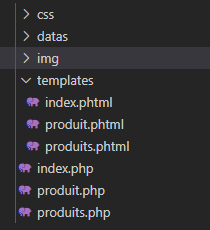
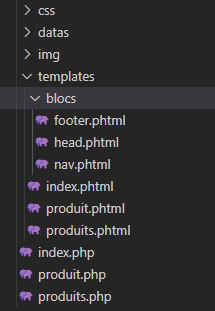
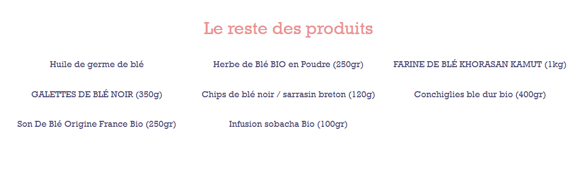
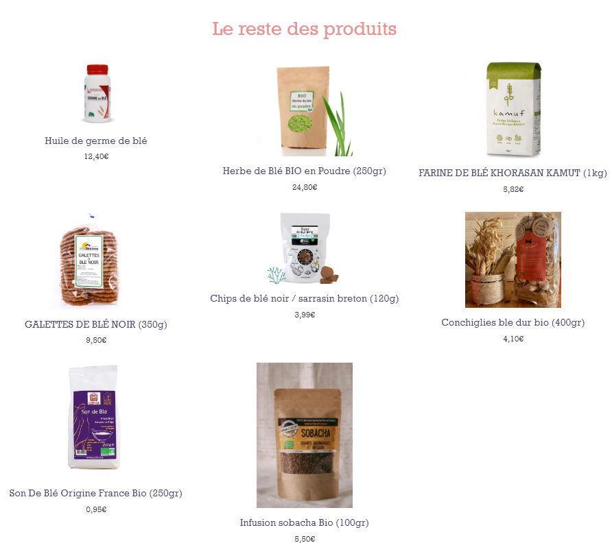
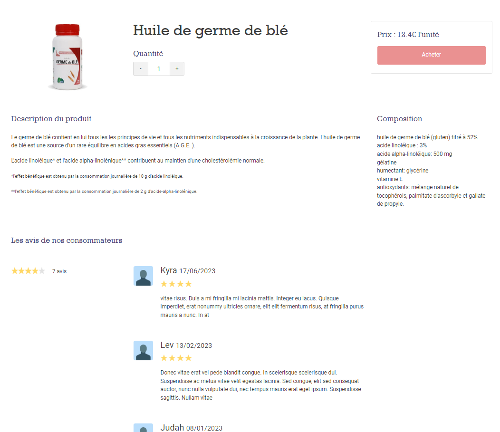
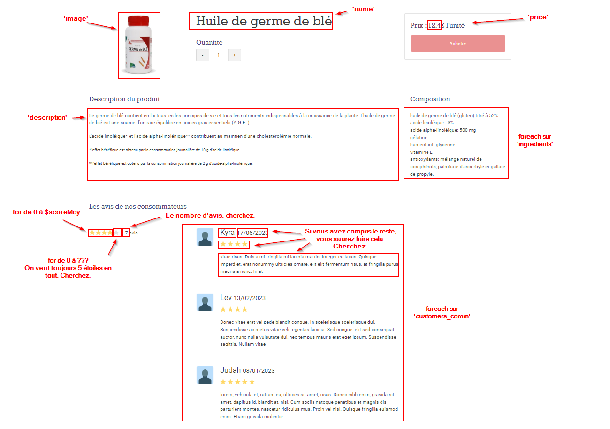

###### Programmation PHP
# Le Templating PHP

## Présentation

Le principe de templating est le fait d'inclure, au sein de votre HTML, des instructions de codes qui permettent de rendre celui-ci dynamique.

Ceci présente plusieurs avantages :
- éviter le HTML redondant : si vous avez dix pages, inutile de faire dix navs, dix footers...
- faciliter la maintenance : une seule modification peut se répercuter sur l'ensemble du site.
- dynamiser le contenu : on va chercher les données en BDD et on génère du contenu à partir de ces données.

## 1/ Passer les pages en PHTML

### 1.1/ Renommer les pages en .phtml

Pour cette étape il faut renommer toute vos pages *'.html'* en *'.phtml'* est les transférer dans un sous dossier par exemple *'templates'*.

### 1.2/ Créer des fichiers .php

Ensuite, il faut créer des fichiers *'.php'* à la racine de votre site. Un fichier *'.php'* par fichier '.phtml'.

Chacun de ces fichier '.php' à la responsabilité de charge le fichier '.phtml' qui lui est associé, voici le contenu du fichier *'index.php'* :

```PHP
    // CHARGE LE TEMPLATE DE LA PAGE D'ACCUEIL
    require_once 'templates/index.phtml';
```

L'instruction [require_once](https://www.php.net/manual/fr/function.require-once.php) est l'une des instructions possibles permettant à un fichier *'.php'* d'en charge un autre. Elle charge **une seule fois** et **obligatoirement** un autre fichier. Si le fichier n'est pas trouvé, le programme plante. C'est souvent préférable à laisser le programme continuer alors que quelque chose de critique qui aurait dû être chargé ne l'a pas été.

### 1.3/ Corriger les liens

Maintenant, il faut corriger les liens sur votre site. En effet, jusqu'ici, tous vos liens pointaient vers des fichiers *'.html'* vous allez devoir tous les corriger pour les faire pointer vers les fichiers *'.php'*

Voici à quoi devrait ressembler le contenu de votre dossier de travail à la fin de cette étape :



## 2/ Découpage des pages en blocs

### 2.1/ création du fichier *'nav.phtml'*

La deuxième étape du templating consiste à trouver dans les différentes pages des blocs qui se répètent afin de les mutualiser. Le plus évident pour le moment est la barre de nav du site qui est toujours la même pour toutes les pages.

Créez un dossier *templates/blocs* et créez-y un nouveau fichier *'nav.phtml'* puis, collez dans ce fichier tout le HTML de votre nav.

Il ne vous reste plus qu'à aller modifier vos fichiers *'.phtml'* en y remplaçant tout le HTML de votre nav par une instruction qui chargera votre fichier *'nav.phtml'*.

**Exemple de la page d'accueil :**
```html
    <header id="entete">
        <?php include './templates/blocs/nav.phtml' ?>
        <div id="titre" class="container d-flex justify-content-between flex-column align-items-center">
            <h1 class="roboto black">DES ENCAS SAINS POUR LA JOURNÉE</h1>
            <h2 class="rockwell">Des produits sains à base de blé bio à grignoter pendant la journée 😀🌽</h2>
            <a class="shadow" href="#concept">Découvrir</a>
        </div>
    </header>
```

L'instruction [include](https://www.php.net/manual/fr/function.include.php) est une autre façon de charger un fichier en PHP. Elle est plus souple car le chargement n'est **pas obligatoire** et le fichier peut être chargé **plusieurs fois**.

### 2.2/ Généralisation du processus

Avec le projet *Cornfood* vous pouvez facilement créer au moins deux autres *"blocs"* en PHTML, un pour le footer - et les scripts JS chargées en fin de page - et un autre pour le *head* du html et tout son contenu, y compris le chargement des fichiers CSS.

Voici à quoi peut ressembler votre dossier de travail à la fin de cette étape :



> **Note importante** : 
>
> On pourrait être tenté ici de mettre le début de chaque page HTML dans le fichier *'head.phtml'* et la fin dans *'footer.phtml'*, toutefois, de faisant, on casserait la balise ```<html>``` en deux, un bout dans chaque fichier. De même, la balise ```<body>``` se trouverait partagée entre les différentes pages *'.phtml'* et le fichier *'footer.phtml'*.
>
> On évitera toujours d'éclater ainsi une balise HTML entre plusieurs fichiers, cela complique la maintenance et multiplie fortement les risque d'erreurs. Répétez-vous ceci ***"si j'ouvre une balise html dans un fichier, je la ferme dans ce fichier et nul par ailleurs"***.
>
> Certains frameworks/developpeurs ne se gènenent pas pour le faire, mais ce n'est pas parceque les autres travaillents comme des cochons que vous devait faire pareil.

## 3/ Dynamisation du contenu

### 3.1/ Le fichier 'datas/products.php'

Ouvrez ce fichier pour voir son contenu. Il s'agit en fait juste d'un énorme tableau ```$products``` à plusieurs dimensions qui contient un ensemble de données sur des produits à afficher dans la boutique.

Ainsi :
- ```$products[0]``` est le premier produit
- ```$products[1]``` est le deuxième produit
- ```$products[0]['name']``` est le nom du premier produit
- ```$products[0]['price']``` est le prix du premier produit
- ```$products[0]['ingredients']``` est un sous-tableau qui contient la liste des ingrédients du premier produit, donc :
    - ```$products[0]['ingredients'][0]``` est le premier ingrédient du premier produit
    - ```$products[0]['ingredients'][1]``` est le deuxième ingrédient du premier produit
- ```$products[1]['ingredients']``` est le sous-tableau qui contient la liste des ingrédients du deuxième produit, donc :    
    - ```$products[1]['ingredients'][0]``` est le premier ingrédient du deuxième produit
    - ```$products[1]['ingredients'][1]``` est le deuxième ingrédient du deuxième produit
- ```$products[0]['customers_comm']``` est un sous-tableau qui contient la liste des commentaires du premier produit, donc :
    - ```$products[0]['customers_comm'][0]``` est le premier commentaire du premier produit, et c'estr lui-même un sous-tableau :
        - ```$products[0]['customers_comm'][0]['name]``` est le nom de la première personne qui a posté le premier commentaire du premier produit
        - ```$products[0]['customers_comm'][0]['score]``` est le score que la première personne a attribué au premier produit 

Bref, vous avez compris le principe.

Votre première tâche va-t-être de relier ce fichier à vos pages *'produits.php'* et *'produit.php'* afin que ce tableau soit systématiquement chargé sur toutes vos pages, même si il n'est pas, encore, utilisé.

**Exemple de la page *'produits.php'* :**

```PHP
    // CHARGE LES DATAS DES PRODUITS
    require_once 'datas/products.php';

    // CHARGE LE TEMPLATE DE LA PAGE DES PRODUITS
    require_once 'templates/produits.phtml';
``` 

### 3.2/ Page produits.phtml

Il est temps maintenant de dynamiser votre contenu.

La première chose va-t-être de faire en sorte que la page 'produits.phtml' affiche bien plusieurs produits différents provenant du tableau ```$products```.

Vous allez devoir utiliser une boucle un peut particulière, le [foreach](https://www.php.net/manual/fr/control-structures.foreach.php) (POUR CHAQUE). Cette boucle permet d'obtenir un par un tous les éléments d'un tableau. 

Donc, on va pouvoir obtenir, un par un, tous les produits contenus dans le tableau ```$products```.

La syntaxe classique du [foreach](https://www.php.net/manual/fr/control-structures.foreach.php) est la suivante :

```PHP
    foreach ($array as $key => $value) {
        ...
    }
```
On donne le tableau ```$array``` à la boucle [foreach](https://www.php.net/manual/fr/control-structures.foreach.php) et elle parcourt tous les éléments du tableau en nous donnant, à chaque tour, l'index ```$key``` et le contenu ```$value``` de l'élément en question.

Il va falloir, ici, utiliser la syntaxe alternative, plus propre lorsque l'on dynamise du PHTML :

```PHP
    foreach ($array as $key => $value) :
        ...
    endforeach;
```

Cette syntaxe, aussi possible pour les ```if```, ```for```, ```while``` et autres structures, permet d'obtenir une écriture beaucoup plus lisible du phtml.

Essayez de remplacer le html de la liste des produits de la page *'produits.phtml'* par le code suivant :

```HTML
    <ul class="row">
        <?php foreach($products as $id => $product) : ?>
        <li class="col-md-4 col-sm-12">
            <a href="produit.php">
                <h3><?=$product['name']?></h3>
            </a>
        </li>
        <?php endforeach; ?>
    </ul>
```

Vous devriez obtenir une liste de produits comme celle-ci :



La boucle [foreach](https://www.php.net/manual/fr/control-structures.foreach.php) parcourt bien tous les produits du tableau ```$products``` (pluriel) et transfert le contenu de chaque produit dans la variable ```$product``` (singulier). On peut alors afficher le nom du produit en court grâce à l'instruction ```<?=$product['name']?>```.

> **Note** : le ```<?=$var?>``` est un raccourci pour écrire ```<?php echo $var ?>``` 

Maintenant essayez d'afficher également l'image et le prix de chaque produit pour obtenir une liste de produits comme celle-ci :



### page produit.phtml

Il va maintenant falloir s'occuper de la page qui présente le détail d'un produit, mais, avant cela, il faut faire une dernière modification dans la page *'produits.phtml'*.

Modifiez le lien vers la page *'produit.phtml'* comme suit :

```html
    <a href="produit.php?id=<?=$id?>">
```

Ceci va faire en sorte *d'envoyer* l'id d'un produit dans l'url, vers la page *'produit.php'* ce qui permettra à celle-ci de savoir sur quel produit l'utilisateur à cliqué.

Après la modification, voyez comme l'url de la page est modifiée dans la barre d'url de votre navigateur lorsque vous cliquez sur un produit de la liste.

Maintenant, dans le fichier *'produit.php'* faites un copier-coller du code suivant :

```PHP
<?php

// CHARGE LES DATAS DES PRODUITS
require_once 'datas/products.php';

// VÉRIFIE SI ON A BIEN REÇU UNE DEMANDE DE PRODUIT
if (!isset($_GET['id'])){
    header('location:index.html');
    die();
}
$id = $_GET['id'];

// CHARGE LE PRODUIT DEMANDÉ
$product = $products[$id];

// CALCUL DU SCORE MOYEN DES COMMENTAIRES
$scoreMoy = 0;
foreach($product['customers_comm'] as $comm){
    $scoreMoy += $comm['score'];
}
$scoreMoy = round($scoreMoy/count($product['customers_comm']));

// CHARGE LE TEMPLATE DU DÉTAIL D'UN PRODUIT
require_once 'templates/produit.phtml';
```

Ce code est largement commenté et ne devrait pas poser de gros problèmes de compréhension. Certaines notions comme le ```$_GET[]``` seront abordées en détail un peu plus tard dans votre apprentissage, donc, ne vous en faites pas si tout n'est pas parfaitement clair.

Pour le moment, acceptez le fait que ce code :
- charge le fichier de données 'datas/products.php'
- récupère l'id du produit reçu dans l'url
- charge le produit portant cet id dans une variable ```$product``` (singulier)
- calcul la moyenne de toutes les notes de ce produit et la stocke dans une variable ```$scoreMoy```
- charge le template *'produit.phtml'*

En sortie de ce script, au chargement du template *'produit.phtml'*, vous disposez donc de deux variables importantes : 
- ```$product``` : toutes les infos du produit en court
- ```$scoreMoy``` : le nombre moyen d'étoiles attribuées à ce produit par les utilisateurs.

Avec l'aide de votre formateur, modifiez le template *'produit.phtml'* pour obtenir une contenu dyunamique dans votre page comme suit :



Exactement la même page pourra donner, avec un autre produit, ceci :


Pour identifier les structures et instructions à mettre dans votre PHTML, vous pouvez vous aider de l'image suivante :

